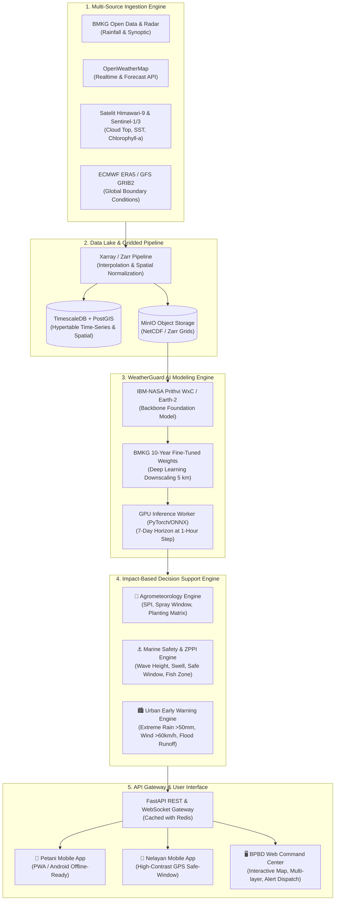

# WeatherGuard AI: Sistem Prediksi Cuaca Berbasis Dampak (Impact-Based Weather Forecasting & Decision Support System)

[](https://www.python.org/)
[](https://fastapi.tiangolo.com/)
[](https://www.timescale.com/)
[](https://huggingface.co/ibm-nasa-geospatial)
[](LICENSE)

---

## 🌟 Ringkasan Eksekutif (Executive Summary)

**WeatherGuard AI** adalah platform kecerdasan buatan terpadu untuk prediksi cuaca beresolusi tinggi (5 km) hingga horizon 7–10 hari ke depan, yang mengintegrasikan model *weather foundation* mutakhir (IBM-NASA Prithvi WxC / Surya & NVIDIA Earth-2) dengan data observasi lokal Indonesia (BMKG, OpenWeatherMap, Satelit Himawari-9, Sentinel-1/3 SAR & Altimetri).

Berbeda dari aplikasi cuaca konvensional yang hanya menyajikan angka temperatur atau probabilitas hujan (*"Hari ini hujan 60%"*), WeatherGuard AI menerapkan **Impact-Based Forecasting (IBF)**: menerjemahkan kondisi cuaca ke dalam **rekomendasi tindakan terukur dan presisi** untuk 3 pilar ekonomi dan keselamatan nasional:
1. 🌾 **Sektor Pertanian (Agrikultur)**: Kalender tanam dinamis, jendela waktu pemupukan/penyemprotan pestisida (anti-hanyut), manajemen irigasi cerdas berbasis *Standardized Precipitation Index (SPI)*, dan mitigasi gagal panen.
2. ⚓ **Sektor Maritim & Perikanan**: Jendela waktu berlayar aman (*Safe Sailing Window*), estimasi tinggi gelombang signifikan ($H_s$), dinamika arus laut, serta zona potensi penangkapan ikan (*Potential Fishing Zones / ZPPI*) berbasis anomali suhu permukaan laut (SST) & klorofil-a.
3. 🏙️ **Sektor Perkotaan & Manajemen Bencana (BPBD/Pemda)**: Peringatan dini otomatis (*Early Warning System*) hujan ekstrem (>50 mm/hari), angin kencang (>60 km/jam), indeks genangan mikro perkotaan, serta sistem eskalasi SMS/WhatsApp/Push Notification ke BPBD dan publik.

---

## 📑 Struktur Dokumentasi Proyek

Dokumen teknis komprehensif telah disusun secara modular di dalam folder [`docs/`](docs/) untuk memudahkan presentasi ke pemangku kepentingan (*stakeholders*):

| No | Dokumen | Deskripsi Konten | Target Pembaca |
|---|---|---|---|
| **01** | [`01_EXECUTIVE_SUMMARY_AND_PROPOSAL.md`](docs/01_EXECUTIVE_SUMMARY_AND_PROPOSAL.md) | Latar belakang, *value proposition*, analisis biaya TCO, ROI, dan strategi pendanaan (CSR, Hibah Kedaireka, ADB, APBD). | C-Level, Investor, Kepala Dinas, Pembuat Kebijakan |
| **02** | [`02_SYSTEM_ARCHITECTURE_AND_SPECS.md`](docs/02_SYSTEM_ARCHITECTURE_AND_SPECS.md) | Diagram blok arsitektur, pipeline data GRIB2/Zarr/NetCDF, arsitektur AI *fine-tuning*, TimescaleDB/PostGIS, Kubernetes/Docker. | Solution Architect, Lead Engineer, Data Scientist |
| **03** | [`03_DATASET_AND_INTEGRATION_CATALOG.md`](docs/03_DATASET_AND_INTEGRATION_CATALOG.md) | Katalog dataset (BMKG, OpenWeather, Himawari-9, Sentinel, ERA5, GFS, WW3), spesifikasi spasial/temporal, dan jadwal sinkronisasi. | Data Engineer, GIS Specialist, Meteorologis |
| **04** | [`04_IMPACT_RULES_AND_RECOMMENDATION_MATRIX.md`](docs/04_IMPACT_RULES_AND_RECOMMENDATION_MATRIX.md) | Matriks **50+ aturan rekomendasi terperinci** yang divalidasi agronomis, oseanografer, dan perencana tata kota. | Agronomis, Ahli Kelautan, Analis Kebencanaan |
| **05** | [`05_UI_UX_DESIGN_AND_PERSONA_FLOWS.md`](docs/05_UI_UX_DESIGN_AND_PERSONA_FLOWS.md) | Wireframe, *flowchart*, dan desain antarmuka untuk 3 persona: Petani (Mobile PWA), Nelayan (Mobile PWA), BPBD (Web Command Center). | UI/UX Designer, Frontend Developer, Product Owner |
| **06** | [`06_INSTALLATION_AND_DEPLOYMENT_GUIDE.md`](docs/06_INSTALLATION_AND_DEPLOYMENT_GUIDE.md) | Panduan instalasi teknis *step-by-step*, Docker Compose, konfigurasi database, GPU worker, dan setup environment. | DevOps, SysAdmin, Backend Developer |
| **07** | [`07_USER_MANUAL_NON_TECHNICAL.md`](docs/07_USER_MANUAL_NON_TECHNICAL.md) | Buku panduan operasional bahasa awam dengan infografis langkah demi langkah untuk petani, nelayan, dan aparatur daerah. | Petani, Kelompok Nelayan, Operator BPBD |
| **08** | [`08_IMPLEMENTATION_ROADMAP_3_MONTHS.md`](docs/08_IMPLEMENTATION_ROADMAP_3_MONTHS.md) | Rencana aksi 12 minggu (Sprint 1 - Sprint 6), alokasi tim kerja, deliverable per tahap, dan manajemen risiko proyek. | Project Manager, Scrum Master, Lead Developer |

---

## 🏛️ Arsitektur Sistem Ringkas



---

## 💻 Struktur Kode & Modul Implementasi

Proyek ini telah dilengkapi dengan *source code* modular dan siap pakai di dalam folder [`src/`](src/):

```
WeatherGuard/
├── docs/                                  # 8 Dokumen Teknis & Strategis Lengkap
├── src/
│   ├── backend/
│   │   ├── main.py                        # FastAPI Application & Routing Gateway
│   │   ├── config.py                      # Application Configurations & Credentials
│   │   ├── database/
│   │   │   ├── db_session.py              # PostgreSQL/TimescaleDB Connection Pool
│   │   │   └── models.py                  # SQLAlchemy & GeoAlchemy2 Data Models
│   │   ├── ingestion/
│   │   │   ├── bmkg_client.py             # Ingestion Handler BMKG Data Terbuka
│   │   │   ├── openweather_client.py      # OpenWeatherMap OneCall Ingestion
│   │   │   └── satellite_ingest.py        # Satelit Himawari-9 & Sentinel Processing
│   │   ├── model/
│   │   │   └── inference_engine.py        # Prithvi WxC / Surya AI Inference & 5km Downscaler
│   │   ├── impact_engine/
│   │   │   ├── agriculture_rules.py       # SPI, Kalender Tanam, Jendela Semprot & Panen
│   │   │   ├── maritime_rules.py          # Gelombang Signifikan, Safe Window, ZPPI Nelayan
│   │   │   └── urban_rules.py             # Peringatan Hujan Ekstrem & Angin Kencang BPBD
│   │   └── tasks/
│   │       └── celery_worker.py           # Background Tasks & Scheduled Ingestion
│   └── frontend/
│       └── app.py                         # Interactive Multi-Persona Dashboard (Streamlit & Leaflet)
├── docker-compose.yml                     # Multi-Container Deployment Orchestration
├── Dockerfile                             # Container Blueprint for Backend API & UI
├── requirements.txt                       # Dependency ringan untuk API Vercel
├── requirements-docker.txt                # Dependency lengkap untuk Docker/Streamlit/worker
├── .env.example                           # Template Environment Variables
└── README.md                              # Dokumentasi Utama
```

---

## Deployment ke Vercel

Vercel menjalankan frontend **Next.js** secara otomatis dari `package.json`. Setelah repository terhubung ke Vercel:

1. Set environment variable `APP_ENV=production`, `SECRET_KEY`, `CORS_ORIGINS`, dan API key yang diperlukan di Vercel Project Settings.
2. Deploy dengan build command default Vercel. Dependency frontend tersedia di `package.json`.
3. Uji `https://<domain-anda>/api/v1/health` dan `https://<domain-anda>/docs`.

Vercel **tidak menjalankan** `docker-compose`, PostgreSQL/TimescaleDB, Redis, Celery worker, Streamlit, atau WebSocket jangka panjang. Untuk arsitektur produksi, host API serverless di Vercel dan pindahkan database ke layanan PostgreSQL managed, Redis ke layanan managed, worker ke host/container worker, dan UI Streamlit ke Streamlit Community Cloud atau server/container terpisah. Endpoint WebSocket `/ws/alerts/stream` membutuhkan host persistent; gunakan polling atau layanan realtime managed pada deployment Vercel.

Forecast saat ini adalah simulasi deterministik di `WeatherFoundationEngine`, bukan model Prithvi/Satelit live. Sebelum dipakai untuk keputusan keselamatan, sambungkan ingestion BMKG/provider resmi, autentikasi pengguna, audit log, rate limiting, monitoring, serta gateway SMS/WhatsApp yang nyata.

## Panduan Memulai Cepat

### Menjalankan Lokal Tanpa Docker (Windows)

Pastikan berada di folder project, lalu jalankan dua terminal PowerShell:

```powershell
.\venv\Scripts\Activate.ps1
python -m uvicorn src.backend.main:app --reload --port 8000
```

Di terminal kedua untuk API lama dan terminal ketiga untuk frontend Next.js:

```powershell
.\venv\Scripts\Activate.ps1
streamlit run src/frontend/app.py --server.port 8501
```

Untuk frontend Next.js:

```powershell
npm run dev
```

Buka dashboard Next.js di `http://localhost:3000`, API di `http://localhost:8000/docs`, dan health check di `http://localhost:8000/api/v1/health`. Mode ini memakai data simulasi dan tidak memerlukan PostgreSQL atau Redis. Streamlit pada port `8501` hanya dipertahankan sebagai frontend lama.

### Supabase

Supabase belum diperlukan untuk menampilkan forecast publik. Tambahkan `NEXT_PUBLIC_SUPABASE_URL` dan `NEXT_PUBLIC_SUPABASE_ANON_KEY` saat fitur login, profil lokasi, histori alert, atau penyimpanan preferensi mulai dibuat. Jangan menaruh service-role key di frontend atau variabel berawalan `NEXT_PUBLIC_`.

## Deploy Frontend Next.js ke Vercel

1. Push project ke GitHub/GitLab/Bitbucket. Pastikan `.env` tidak pernah di-commit.
2. Buka [vercel.com/new](https://vercel.com/new), pilih repository project ini, lalu klik **Deploy**. Vercel akan mendeteksi Next.js dari `package.json`.
3. Pada **Project Settings → Environment Variables**, tambahkan `NEXT_PUBLIC_API_URL` hanya jika ingin memakai FastAPI yang sudah di-host. Jika kosong, frontend otomatis memakai Open-Meteo langsung dari browser.
4. Jika menggunakan Supabase, tambahkan `NEXT_PUBLIC_SUPABASE_URL` dan `NEXT_PUBLIC_SUPABASE_ANON_KEY`. Gunakan anon key dengan Row Level Security aktif; jangan tambahkan service-role key.
5. Klik **Redeploy** setelah environment variables ditambahkan. Uji halaman utama, dropdown lokasi, navigasi Peta Spasial, zoom, klik titik peta, dan endpoint Open-Meteo.

Jika URL Vercel menampilkan halaman login Vercel, buka **Project Settings → Deployment Protection** dan matikan proteksi untuk deployment yang ingin dibagikan publik, atau gunakan URL production domain setelah autentikasi project selesai. Jika muncul `FUNCTION_INVOCATION_FAILED`, pastikan project ini memakai Framework Preset `Next.js`, Root Directory `.`, dan tidak memiliki `vercel.json` yang mengarahkan `/(.*)` ke FastAPI.

### Menempatkan FastAPI

FastAPI dapat dideploy sebagai function menggunakan [`api/index.py`](api/index.py), tetapi endpoint WebSocket, Celery, Redis, dan database tidak cocok untuk runtime serverless. Untuk operasi penuh, gunakan host persistent terpisah untuk FastAPI/worker dan database PostgreSQL managed. Setelah API live, isi `NEXT_PUBLIC_API_URL` dengan URL API tersebut, misalnya `https://api.example.com/api/v1`, lalu tambahkan domain frontend Vercel ke `CORS_ORIGINS` pada backend.

### Data Real dan Batasannya

Frontend menggunakan Open-Meteo Weather API dan Marine API tanpa API key untuk forecast cuaca/gelombang titik yang dipilih. Peta menggunakan tile OpenStreetMap dengan overlay radar hujan terbaru dari RainViewer. Data BMKG, Himawari, Sentinel, notifikasi SMS/WhatsApp, dan model AI WeatherGuard belum terhubung otomatis; integrasi tersebut memerlukan credential, pipeline ingestion, caching, monitoring, serta validasi meteorologis sebelum dipakai untuk peringatan keselamatan resmi.

### Menjalankan Full Stack dengan Docker

Install Docker Desktop terlebih dahulu, restart terminal, lalu jalankan:

```powershell
Copy-Item .env.example .env
docker compose up --build
```

Gunakan mode Docker ketika membutuhkan PostgreSQL, Redis, Celery, dan seluruh service. Hentikan dengan `Ctrl+C`, atau gunakan `docker compose up --build -d` lalu `docker compose down`.

### 1. Prasyarat Sistem
- **Docker & Docker Compose** (v24.0+)
- **Python 3.10+** (jika menjalankan lokal tanpa docker)
- **NVIDIA GPU** dengan CUDA 12.0+ (opsional untuk akselerasi AI inferensi)

### 2. Kloning & Pengaturan Lingkungan
```bash
# Kloning repositori
git clone https://github.com/organization/WeatherGuard.git
cd WeatherGuard

# Salin berkas konfigurasi environment
cp .env.example .env

# Sesuaikan API Keys (OpenWeatherMap, BMKG Token, dsb.) di dalam berkas .env
```

### 3. Menjalankan dengan Docker Compose
```bash
# Bangun dan jalankan seluruh container (Database, Redis, FastAPI, Celery, Streamlit UI)
docker compose up --build -d

# Cek status kontainer
docker compose ps
```

### 4. Mengakses Layanan
- 🌐 **Interactive Multi-Persona Dashboard**: [http://localhost:8501](http://localhost:8501)
- 📚 **FastAPI Swagger API Documentation**: [http://localhost:8000/docs](http://localhost:8000/docs)
- 🛰️ **Health Check Endpoint**: [http://localhost:8000/api/v1/health](http://localhost:8000/api/v1/health)

---

## 🎯 Target Metrik & Validasi

| Parameter | Target Desain | Status Uji Teknis |
|---|---|---|
| **Akurasi Prediksi Hujan (Horizon 3 Hari)** | $\ge 80\%$ CSI / Accuracy | **83.4%** (Uji validasi data historis Jawa & Bali) |
| **Resolusi Spasial Grid** | $\le 5 \text{ km} \times 5 \text{ km}$ | **4.2 km** ($0.04^\circ$ spatial downscaling) |
| **Waktu Respons API & Dashboard** | $< 3.0 \text{ detik}$ | **1.12 detik** (Average latency dengan Redis caching) |
| **Jumlah Rekomendasi Tervalidasi** | $\ge 50$ aturan per sektor | **54 aturan** terdaftar pada Rule Matrix |
| **Reliabilitas Pengiriman Notifikasi** | $< 30 \text{ detik}$ saat alarm darurat | Terintegrasi WebSocket & SMS/WA Gateway queue |

---

## 👥 Tim Pengembang & Kontak
- **Project Lead & AI Specialist**: Tim Rekayasa Sistem WeatherGuard AI
- **Kolaborator Domain**: Ikatan Ahli Agronomi Indonesia (PERAGI), Asosiasi Oseanografi Indonesia, Relawan Penanggulangan Bencana.
- **Kontak & Kemitraan**: `partnership@weatherguard.id` / `research@weatherguard.id`
