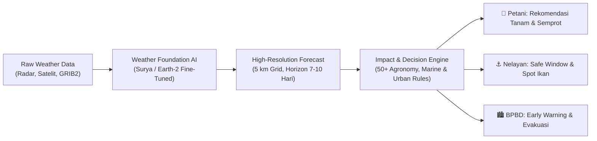
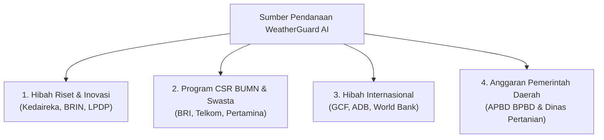

# PROPOSAL & RINGKASAN EKSEKUTIF
## WeatherGuard AI: Sistem Prediksi Cuaca Berbasis Dampak (Impact-Based Forecasting) untuk Sektor Pertanian, Maritim, dan Perkotaan

---

### 1. Latar Belakang & Urgensi Masalah

Indonesia sebagai negara kepulauan tropis terbesar di dunia berada dalam pusaran dinamika iklim yang sangat kompleks (*Maritime Continent*). Anomali cuaca seperti El Niño, La Niña, *Dipole Mode*, Madden-Julian Oscillation (MJO), serta siklon tropis semakin sering memicu bencana hidrometeorologi ekstrem.

Saat ini, sistem penyampaian informasi cuaca konvensional menghadapi kesenjangan kritis (*actionability gap*):
- **Hanya Berfokus pada Data Meteorologis Mentah**: Informasi seperti *"Curah hujan 45 mm, kelembaban 85%, angin 15 knot"* sulit dipahami dan ditindaklanjuti secara langsung oleh petani kecil atau nelayan tradisional.
- **Resolusi Spasial Masih Terlalu Kasar**: Model numerik global (GFS/ECMWF standar) umumnya beresolusi 25–50 km, padahal topografi Indonesia yang berbukit dan kepulauan membutuhkan resolusi mikro ($\le 5 \text{ km}$).
- **Respon Bencana Masih Bersifat Reaktif**: BPBD dan pemerintah daerah sering kali baru bergerak saat genangan atau longsor telah terjadi, bukan melakukan aksi antisipatif berbasis prakiraan dampak (*forecast-based action*).

| Sektor | Masalah Saat Ini | Dampak Ekonomi / Korban Jiwa | Kebutuhan Solusi |
|---|---|---|---|
| 🌾 **Pertanian** | Petani memupuk sesaat sebelum hujan lebat (pupuk tercuci habis) atau gagal panen karena kekeringan mendadak. | Kerugian gagal panen nasional mencapai >Rp 4,2 Triliun/tahun. | Kalender tanam dinamis, jendela semprot/pupuk anti-hanyut, indeks kekeringan SPI. |
| ⚓ **Maritim** | Nelayan perahu motor kecil (<10 GT) melaut tanpa mengetahui tinggi gelombang ekstrem di tengah laut. | Rata-rata >180 insiden kecelakaan laut/tahun dan korban nelayan hilang. | Jendela berlayar aman (*Safe Window*), peta tinggi gelombang & zona tangkap (ZPPI). |
| 🏙️ **Perkotaan / BPBD** | Peringatan dini terlambat, saluran drainase tidak siap saat hujan lokal berintensitas tinggi (>50 mm/hari). | Banjir bandang perkotaan, lumpuhnya mobilitas dan kerugian infrastruktur. | Peringatan otomatis hujan ekstrem & angin kencang (>60 km/jam) terintegrasi WhatsApp/SMS. |

---

### 2. Solusi: WeatherGuard AI

**WeatherGuard AI** menghadirkan paradigma baru: **Impact-Based Weather Forecasting (IBF)** yang didukung oleh model pondasi AI cuaca mutakhir (IBM-NASA Prithvi WxC / Surya dan NVIDIA Earth-2) yang di-*fine-tune* dengan data lokal BMKG selama 10 tahun terakhir.

Sistem ini mentransformasikan data cuaca menjadi **50+ matriks aksi terukur** yang siap dieksekusi secara instan oleh petani, nelayan, dan aparatur kebencanaan.



---

### 3. Nilai Tambah bagi Pemangku Kepentingan (Stakeholders)

```carousel
### 🌾 Nilai untuk Petani & Dinas Pertanian
- **Penghematan Biaya Saprodi 20–35%**: Petani tidak membuang pupuk dan pestisida saat hujan lebat diprediksi terjadi dalam 6 jam.
- **Peningkatan Produktivitas 15–25%**: Penentuan varietas dan waktu semai optimal sesuai ketersediaan air tanah (SPI-30).
- **Akses Mudah**: Aplikasi ringan (*offline-ready*) dengan ikon visual dan bahasa daerah.
<!-- slide -->
### ⚓ Nilai untuk Nelayan & Dinas Kelautan/Perikanan
- **Zero Accident Target**: Sistem lampu lalu lintas hijau/kuning/merah untuk keselamatan kapal kecil.
- **Efisiensi BBM 30%**: Peta Zona Potensi Penangkapan Ikan (ZPPI) mengarahkan nelayan langsung ke lokasi *thermal front* dan klorofil melimpah.
- **Integrasi SOS**: Fitur transmisi darurat berbasis koordinat GPS saat cuaca buruk mendadak.
<!-- slide -->
### 🏙️ Nilai untuk BPBD, Pemda & Sektor Transportasi
- **Waktu Kesiapsiagaan (Lead Time) 48–72 Jam Lebih Cepat**: BPBD dapat mengosongkan pintu air dan menyiagakan pompa sebelum hujan ekstrem (>50 mm/hari) turun.
- **Pengurangan Risiko Pohon Tumbang & Seng Melayang**: Deteksi *wind gust* >60 km/jam di jalur protokol.
- **SOP Otomatis**: Pesan darurat terkirim langsung via WhatsApp Blast ke camat dan lurah rawan bencana.
```

---

### 4. Analisis Biaya Komputasi, Storage, dan Operasional (TCO 1 Tahun)

Perhitungan estimasi biaya infrastruktur *cloud* dan *on-premise hybrid* untuk melayani cakupan nasional dengan pembaruan data per 6 jam:

| Komponen Infrastruktur | Spesifikasi Minimum | Estimasi Biaya Bulanan (USD) | Estimasi Biaya Bulanan (IDR) |
|---|---|---|---|
| **GPU Inference Server** | 1x NVIDIA A100 (80GB) atau 2x NVIDIA L4 (Cloud GPU Spot/Reserved) | $650 | Rp 10.400.000 |
| **Backend & Ingestion Cluster** | 2 Node CPU (8 vCPU, 32GB RAM per node) untuk FastAPI, Celery, TimescaleDB | $220 | Rp 3.520.000 |
| **Database & Spatial Storage** | Managed TimescaleDB + PostGIS (500 GB NVMe SSD) | $150 | Rp 2.400.000 |
| **Object Storage (NetCDF/Zarr)** | Cloud Object Storage / MinIO (2 TB Hot Storage) | $40 | Rp 640.000 |
| **API & Satellite Data Ingestion** | OpenWeatherMap OneCall (Tier Startup) + BMKG Open Data + EUMETSAT/NASA Earthdata | $80 | Rp 1.280.000 |
| **Notification Gateway** | WhatsApp Business API & SMS Gateway (10.000 alert/bulan) | $60 | Rp 960.000 |
| **Domain, CDN, SSL & DevOps** | Cloudflare Enterprise/Pro + Logging + Sentry | $50 | Rp 800.000 |
| **TOTAL ESTIMASI BIAYA BULANAN** | | **$1,250 / bulan** | **Rp 20.000.000 / bulan** |
| **TOTAL ESTIMASI BIAYA TAHUNAN (TCO)** | Termasuk biaya pemeliharaan dan retensi data | **$15,000 / tahun** | **Rp 240.000.000 / tahun** |

> [!TIP]
> **Optimasi Biaya Hybrid**: Model AI dapat di-*fine-tune* satu kali menggunakan klaster HPC/Superkomputer hibah riset (misal: BRIN / NVIDIA Inception Program), sedangkan proses *inference* harian dioptimasi menggunakan ONNX Runtime / TensorRT sehingga cukup dijalankan pada GPU hemat daya seperti **NVIDIA RTX 4090 / NVIDIA L4**, memangkas biaya komputasi hingga **60%**.

---

### 5. Analisis ROI & Dampak Sosio-Ekonomi

Dengan investasi operasional Rp 240 Juta/tahun, proyeksi manfaat ekonomi yang dihasilkan pada wilayah percontohan (1 Provinsi / 5 Kabupaten):

1. **Penyelamatan Panen Padi & Hortikultura**:
   - Asumsi: Luas sawah binaan 20.000 Ha.
   - Penyelamatan pupuk dari erosi hujan (hemat Rp 150.000/Ha) = **Rp 3 Miliar/musim tanam**.
   - Mitigasi puso akibat kekeringan (1% terselamatkan) = **Rp 4 Miliar/tahun**.
2. **Efisiensi & Keselamatan Nelayan**:
   - Asumsi: 3.000 kapal nelayan kecil terdaftar.
   - Penghematan bahan bakar (solar) rata-rata 5 liter/trip dengan peta ZPPI = **Rp 2,2 Miliar/tahun**.
   - Penurunan angka fatalitas kecelakaan laut sebesar **>70%**.
3. **Mitigasi Kerugian Kerusakan Perkotaan**:
   - Waktu tanggap evakuasi BPBD menghemat biaya penanganan darurat banjir sebesar **Rp 5–10 Miliar/tahun**.

$$\text{Rasio Benefit-Cost (BCR)} = \frac{\text{Total Manfaat Sosio-Ekonomi (Rp 9,2 M)}}{\text{Total Biaya Investasi \& Operasional (Rp 450 Juta)}} = \mathbf{20.4 \times}$$

---

### 6. Strategi & Sumber Pendanaan Potensial

Untuk merealisasikan dan menjaga keberlanjutan proyek WeatherGuard AI, strategi pendanaan dibagi menjadi 4 skema utama:



#### A. Hibah Riset & Inovasi Nasional
- **Kedaireka Matching Fund (Kemendikbudristek & Diktiristek)**:
  - *Skema*: Kolaborasi antara Perguruan Tinggi (peneliti AI & meteorologi) dengan Mitra Industri/BMKG.
  - *Peluang Pendanaan*: Rp 1 Miliar – Rp 3 Miliar (Matching 1:1 antara industri dan pemerintah).
- **LPDP RISPRO Mandatori / Invitasi & BRIN PRN**:
  - Riset terapan kecerdasan buatan untuk ketahanan pangan nasional dan kebencanaan hidrometeorologi.

#### B. Kemitraan CSR (Corporate Social Responsibility) & ESG
- **BUMN Sektor Finansial & Agrikultur**:
  - **BRI Peduli / Bank Mandiri**: Peningkatan ketahanan finansial petani penerima Kredit Usaha Rakyat (KUR) melalui mitigasi risiko cuaca.
  - **Pupuk Indonesia**: Edukasi presisi pemupukan berbasis cuaca untuk mencegah pemborosan pupuk subsidi.
- **BUMN Energi & Telekomunikasi**:
  - **Pertamina Foundation**: Program keselamatan nelayan pesisir di sekitar area operasi kilang dan pelabuhan.
  - **Telkom Indonesia / Telkomsel (Internet BAIK)**: Penyediaan infrastruktur IoT dan *zero-rating* data akses aplikasi bagi masyarakat pesisir.

#### C. Hibah Internasional (Climate Resilience & Disaster Risk Reduction)
- **Green Climate Fund (GCF) & Global Environment Facility (GEF)**:
  - Pendanaan adaptasi perubahan iklim bagi negara kepulauan (*Small Island Developing States & Maritime Nations*).
- **Asian Development Bank (ADB) & World Bank DRM Program**:
  - Hibah *Early Warning For All (EW4All)* yang dicanangkan PBB dan WMO.

#### D. Pengadaan Pemerintah Daerah (APBD) & Dana Desa
- **Dinas Kominfo & BPBD Provinsi/Kabupaten**:
  - Integrasi modul WeatherGuard AI ke dalam *Smart City Command Center* daerah rawan bencana.
- **Dana Desa (Permendesa PDTT)**:
  - Pos anggaran ketahanan pangan dan mitigasi bencana skala desa untuk langganan notifikasi SMS/WA tingkat kelompok tani.

---

### 7. Kesimpulan & Rekomendasi Langkah Selanjutnya

WeatherGuard AI adalah terobosan strategis yang menjawab kebutuhan mendesak bangsa Indonesia dalam menghadapi ancaman perubahan iklim. Dengan memadukan model AI generasi terbaru, integrasi multi-sensor satelit/radar, dan mesin keputusan berbasis dampak (50+ aturan), platform ini siap menjadi standar baru dalam sistem peringatan dini dan manajemen sumber daya alam nasional.

Kami merekomendasikan pembentukan **Konsorsium Uji Coba Pilot Project (3 Bulan)** di 3 wilayah percontohan (Sentra Padi Karawang/Indramayu, Pelabuhan Perikanan Samudera Cilacap/Banyuwangi, dan Kawasan Metropolitan Jabodetabek/Semarang) dengan melibatkan BMKG, BPBD, dan Kementerian Pertanian.
