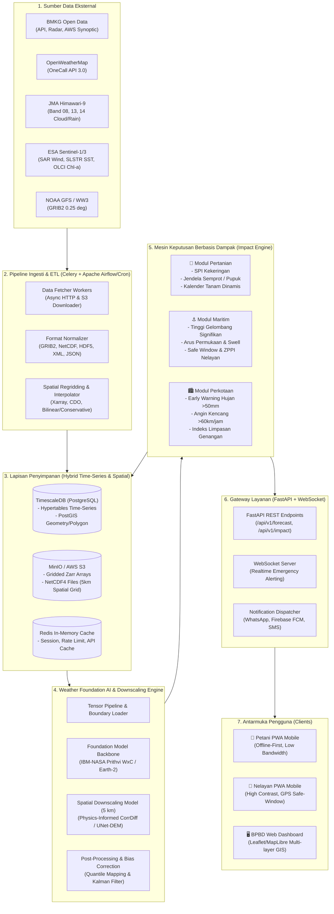
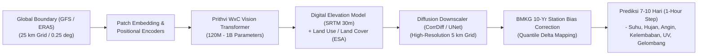
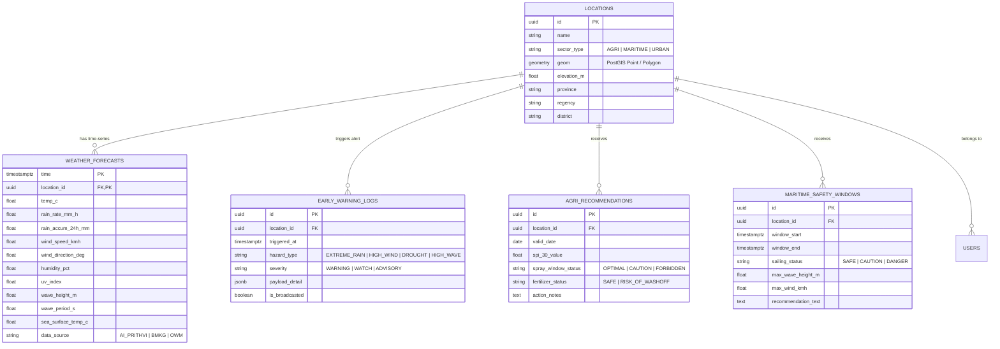
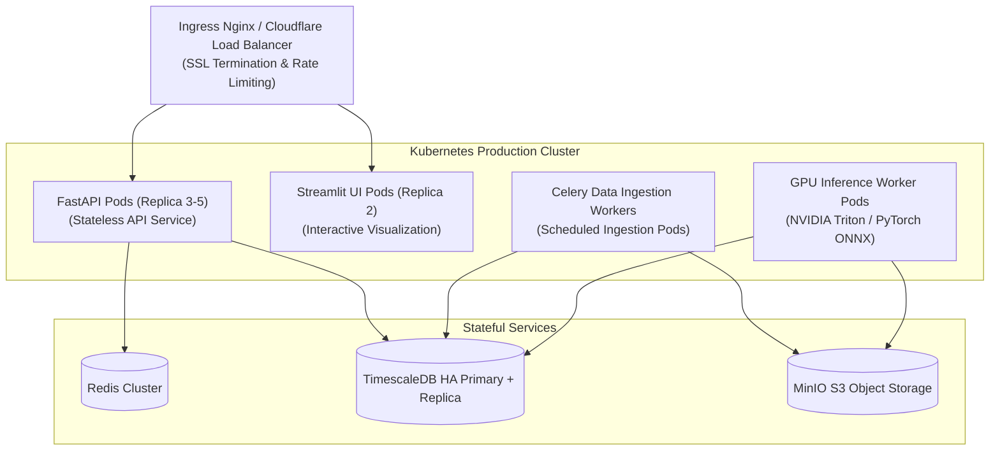

# SPESIFIKASI TEKNIS & ARSITEKTUR SISTEM
## WeatherGuard AI: Arsitektur End-to-End, Model AI Pondasi, Database Time-Series Spasial, dan Pipeline Inferensi

---

### 1. Arsitektur Sistem Terintegrasi (System Block Diagram)

Sistem dirancang menggunakan arsitektur modular berorientasi layanan (*Microservices-oriented & Event-Driven Architecture*), memisahkan tugas penyerapan data (*data ingestion*), pelatihan/inferensi AI berkinerja tinggi (*AI core*), pemrosesan logika dampak (*impact engine*), dan antarmuka pengguna (*frontend delivery*).



---

### 2. Spesifikasi Detail Komponen Sistem

#### A. Pipeline Ingesti Data & Normalisasi Grid
- **Pustaka Pemrosesan Geosparsial**: `xarray`, `rioxarray`, `netCDF4`, `cfgrib`, `pyresample`.
- **Cakupan Spasial Domain Indonesia**:
  - Garis Lintang: $6.0^\circ\text{ LU}$ s.d. $11.0^\circ\text{ LS}$
  - Garis Bujur: $95.0^\circ\text{ BT}$ s.d. $141.0^\circ\text{ BT}$
- **Format Penyimpanan Grid**: Data prediksi spasial disimpan dalam format **Zarr chunked store** di MinIO untuk pemotongan koordinat (*slicing*) secepat kilat ($<50\text{ ms}$).

#### B. Model AI Pondasi & Strategi Downscaling 5 km

Sistem mengadopsi model **IBM-NASA Prithvi WxC** (atau **NVIDIA Earth-2 FourCastNet / CorrDiff**) sebagai *foundation model*, dengan detail teknis berikut:



1. **Backbone Model (Prithvi WxC / Earth-2)**:
   - Arsitektur berbasis *Masked Autoencoder (MAE)* dan *Vision Transformer (ViT)* 3D yang dilatih pada representasi data atmosfer multi-level (geopotensial, temperatur udara, angin U/V pada level 1000hPa hingga 200hPa).
2. **Fine-Tuning dengan Data BMKG 10 Tahun (2014–2024)**:
   - Memasukkan data observasi 200+ stasiun synoptic BMKG, radar maritim C-Band/X-Band, dan AWS untuk mengoreksi bias monsun tropis dan sirkulasi lokal darat-laut (*land-sea breeze*).
3. **Super-Resolusi & Downscaling Spasial (5 km)**:
   - Menggunakan *Physics-Informed Generative Downscaling* dengan menyuntikkan data medan elevasi (*Shuttle Radar Topography Mission - SRTM 30m*) dan tutupan lahan (*Copernicus Land Cover*) sebagai variabel pembimbing (*conditioning features*).

---

### 3. Skema Basis Data (TimescaleDB & PostGIS)

Sistem menggunakan **PostgreSQL 16** yang diperkaya dengan ekstensi:
- **TimescaleDB**: Untuk mengelola data *time-series* cuaca observasi dan prediksi dalam struktur *hypertables* terpartisi otomatis.
- **PostGIS**: Untuk kueri spasial poligon batas administratif desa, koordinat pelabuhan, daerah aliran sungai (DAS), dan polygon lahan pertanian.

#### Diagram Relasi Entitas (ERD)



---

### 4. Spesifikasi API Gateway & Format Response

FastAPI mengelola routing RESTful dan koneksi WebSocket berkinerja tinggi.

#### Contoh Endpoint Utama

| Method | Endpoint | Deskripsi |
|---|---|---|
| `GET` | `/api/v1/forecast/point?lat=-6.9&lon=107.6&days=7` | Mengambil data ramalan cuaca 7 hari resolusi 1 jam pada titik koordinat. |
| `GET` | `/api/v1/impact/agriculture?location_id=xxx` | Menghasilkan rekomendasi tanam, pemupukan, dan indeks SPI. |
| `GET` | `/api/v1/impact/maritime?port_code=TanjungPriok` | Menghasilkan tinggi gelombang, status *Safe Window*, dan peta ZPPI. |
| `GET` | `/api/v1/impact/urban/early-warning` | Mengambil daftar peringatan dini aktif hujan ekstrem & angin kencang. |
| `WS` | `/ws/alerts/stream` | Koneksi WebSocket *realtime* untuk notifikasi gawat darurat BPBD. |

#### Contoh Payload JSON Respon Impact Pertanian
```json
{
  "location": {
    "name": "Kecamatan Telagasari, Karawang",
    "coordinates": [-6.302, 107.408],
    "sector": "AGRICULTURE"
  },
  "generated_at": "2026-08-21T09:00:00Z",
  "spi_index": {
    "spi_30": -0.85,
    "classification": "Normal cenderung kering",
    "irrigation_recommendation": "Aktifkan giliran air irigasi tersier 3 hari sekali."
  },
  "forecast_summary_7d": {
    "total_precipitation_mm": 18.5,
    "max_temp_c": 33.2,
    "avg_humidity_pct": 76.0
  },
  "action_matrix": [
    {
      "date": "2026-08-22",
      "pesticide_spray_window": {
        "status": "OPTIMAL",
        "recommended_hours": "06:00 - 09:00 WIB",
        "reason": "Kecepatan angin <10 km/jam, probabilitas hujan <10%."
      },
      "fertilization": {
        "status": "SAFE",
        "reason": "Tidak ada potensi hujan lebat dalam 24 jam ke depan."
      }
    }
  ]
}
```

---

### 5. Arsitektur Deployment & Orkestrasi Kontainer

Sistem dikemas secara utuh menggunakan standar **Docker & OCI Container**, siap dijalankan pada lingkungan lokal/single-server via **Docker Compose** atau skala *production enterprise* via **Kubernetes (K8s)**.



- **GPU Acceleration**: Inferensi model dijalankan pada *container* beralaskan CUDA 12.0+ dengan dukungan *ONNX Runtime GPU* / *TensorRT* untuk efisiensi throughput komputasi.
- **Failover & Caching**: Setiap hasil prediksi grid 5 km yang telah dihitung akan di-*cache* di Redis dan MinIO, menjamin waktu respons API konsisten di bawah **1.5 detik** meskipun diakses oleh ribuan pengguna secara bersamaan.
