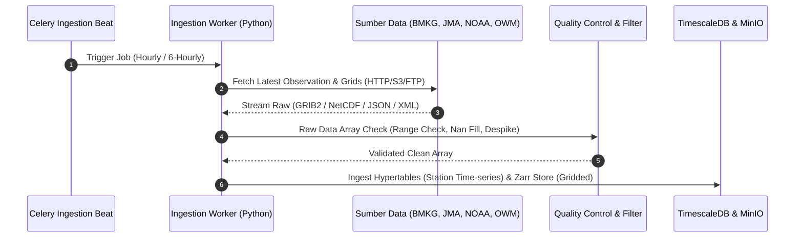

# KATALOG DATASET & PANDUAN INTEGRASI MULTI-SUMBER
## WeatherGuard AI: Spesifikasi Data Satelit, Radar, Model Numerik Global, dan Observasi Lokal Indonesia

---

### 1. Ringkasan Katalog Dataset Terpadu

WeatherGuard AI menggabungkan 7 sumber data primer untuk menghasilkan prakiraan komprehensif dari darat, laut, hingga atmosfer atas:

| Nama Dataset | Penyedia / Sumber | Parameter Utama | Resolusi Spasial | Frekuensi Update | Format Data | Status Lisensi / Akses |
|---|---|---|---|---|---|---|
| **Data Terbuka BMKG** | Badan Meteorologi, Klimatologi, dan Geofisika (BMKG) | Suhu, kelembaban, kecepatan angin, cuaca harian per kecamatan, radar cuaca reflektivitas (dBZ). | Titik Stasiun & Kecamatan (~10-25 km) | Per 1–3 Jam / Harian | XML / JSON REST API | Terbuka / Public API BMKG |
| **Data Historis BMKG 10 Tahun (2014–2024)** | BMKG (Data Center Iklim) | Curah hujan harian, suhu min/max, penguapan, radiasi matahari dari 200+ stasiun synoptic. | Titik Stasiun Observasi | Historis (10 Tahun) | CSV / NetCDF | Akses Riset & Kemitraan Akademis |
| **OpenWeatherMap OneCall 3.0** | OpenWeather Ltd. | *Realtime nowcast*, prakiraan per jam 48 jam, UV Index, tekanan udara, *dew point*. | ~1-2.5 km (interpolated) | Tiap 10 Menit | JSON REST API | Komersial / API Key |
| **Satelit Himawari-9 (AHI)** | Japan Meteorological Agency (JMA) / EUMETSAT / BMKG | Suhu puncak awan (*Brightness Temperature* Band 13/14), potensi awan konvektif Cumulonimbus (CB). | 2.0 km (Infrared), 0.5–1 km (Visible) | Tiap 10 Menit (Full Disk & Rapid Scan) | NetCDF4 / HDF5 / GeoTIFF | Akses Terbuka via JMA Cloud & BMKG Gateway |
| **Sentinel-1 SAR & Sentinel-3 Ocean** | European Space Agency (ESA) Copernicus | *Sentinel-1*: Vektor angin permukaan laut, kekasaran ombak (SAR). *Sentinel-3*: Suhu Permukaan Laut (SST - SLSTR), Klorofil-a (OLCI). | 1 km (SST/OLCI) s.d. 10 m (SAR) | Siklus 1–3 Hari | SAFE / NetCDF4 / GeoTIFF | Bebas / Copernicus Open Access Hub |
| **NOAA GFS & WaveWatch III** | National Oceanic and Atmospheric Administration (NOAA) | Variabel atmosferik global multi-level (U/V wind, geopotensial), spektrum gelombang, tinggi gelombang signifikan ($H_s$). | 0.25° (~27 km) & 0.5° (Gelombang) | 4x Sehari (00, 06, 12, 18 UTC) | GRIB2 | Bebas / NOAA NOMADS S3 Open Data |
| **Topografi & Batimetri Nasional (DEMNAS & BATNAS)** | Badan Informasi Geospasial (BIG) & GEBCO | Elevasi daratan digital 30m (DEMNAS) dan kedalaman laut batimetri (BATNAS/GEBCO). | 8.1 meter (DEMNAS) & 30 arc-second (BATNAS) | Statis (Baseline) | GeoTIFF / NetCDF | Bebas / Ina-Geoportal Indonesia |

---

### 2. Protokol Integrasi & Pipeline Ekstraksi Data

---

### 3. Detail Sumber Data & Spesifikasi Parameter

#### A. Ingesti Data Terbuka BMKG
- **URL Base API**: `https://data.bmkg.go.id/DataMKG/TEKIKAL/` dan `https://api.bmkg.go.id/`
- **Format Payload**: XML & JSON per provinsi dan kabupaten.
- **Pemanfaatan**: Validasi *ground-truth* pengamatan harian, kalibrasi *nowcasting* hujan lokal, dan parameter validasi model AI.

#### B. Ingesti Satelit Himawari-9
- **Saluran Spektral Kunci**:
  - **Band 03 (0.64 µm - Red)**: Visualisasi tutupan awan resolusi tinggi siang hari.
  - **Band 08 (6.2 µm - Upper Troposphere Water Vapor)**: Kelembaban lapisan atas atmosfer.
  - **Band 13 (10.4 µm - Clean IR Window)**: Estimasi suhu puncak awan (*Cloud Top Temperature - CTT*). Jika CTT $< -60^\circ\text{C}$, mengindikasikan awan konvektif tebal pembawa hujan badai petir (*Cumulonimbus*).
- **Protokol Download**: S3 Bucket Open Data Registry (`s3://noaa-himawari9/`) atau FTP Server BMKG.

#### C. Ingesti Satelit Sentinel-3 (Oseanografi & Perikanan)
- **Sentinel-3 SLSTR**: Menghasilkan data *Sea Surface Temperature* (SST) harian dalam format Kelvin/Celsius.
- **Sentinel-3 OLCI**: Menghasilkan konsentrasi Klorofil-a ($mg/m^3$).
- **Aplikasi**: Daerah pertemuan massa air bersuhu kontras (*thermal front*) dan konsentrasi klorofil tinggi merupakan **Zona Potensi Penangkapan Ikan (ZPPI)** tempat berkumpulnya ikan pelagis (tongkol, cakalang, tuna).

#### D. Ingesti NOAA WaveWatch III (WW3)
- **Format**: GRIB2 (`multi_1.glo_30m.t00z.grib2`)
- **Parameter Utama**:
  - `HTSGW`: *Significant Height of Combined Wind Waves and Swell* (meter).
  - `WVDIR`: *Primary Wave Direction* (derajat).
  - `PERPW`: *Primary Wave Mean Period* (detik).
  - `DIRPW`: *Primary Wave Direction* (derajat).

---

### 4. Sistem Kontrol Kualitas Data Otomatis (Quality Control / QC)

Sebelum masuk ke tahap inferensi AI dan database, setiap data mentah melalui 4 tahapan filter validasi:
1. **Range & Plausibility Check**:
   - Temperatur udara dibatasi dalam rentang realistis tropis: $15.0^\circ\text{C} \le T \le 45.0^\circ\text{C}$.
   - Kecepatan angin: $0.0 \le V_{wind} \le 180.0\text{ km/jam}$.
   - Curah hujan per jam: $0.0 \le R_{1h} \le 300.0\text{ mm/jam}$.
   - Tinggi gelombang: $0.0 \le H_s \le 15.0\text{ meter}$.
2. **Spatial Consistency & Despiking**:
   - Mendeteksi anomali *outlier* sensor stasiun yang rusak menggunakan uji *spatial z-score* terhadap 5 stasiun tetangga terdekat.
3. **Temporal Step Check**:
   - Mendeteksi lonjakan temperatur drastis ($>5^\circ\text{C}$ dalam 10 menit) yang tidak wajar.
4. **Missing Value Imputation**:
   - Jika sensor stasiun mengalami *timeout*, sistem melakukan *kriging interpolation* spasial dari grid radar satelit Himawari-9 terdekat secara otomatis.
