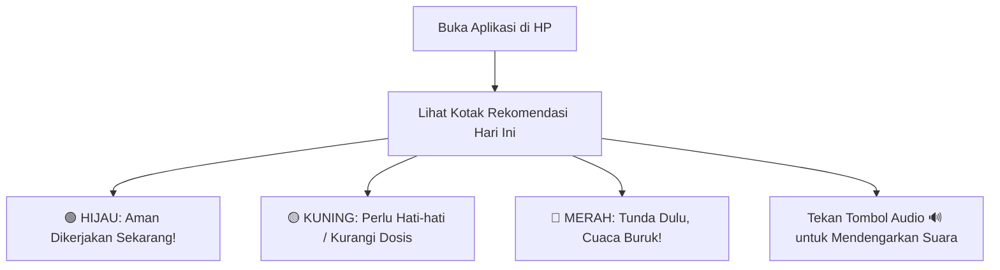
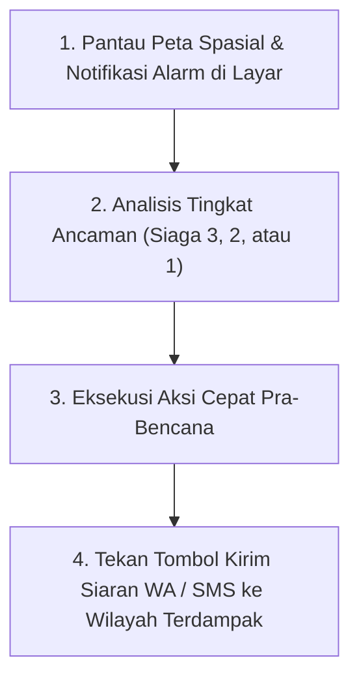

# BUKU PANDUAN PENGGUNAAN NON-TEKNIS
## WeatherGuard AI: Panduan Praktis untuk Petani, Nelayan, dan Petugas Kebencanaan BPBD/Aparatur Desa

---

### 🌾 BAGIAN 1: PANDUAN UNTUK PETANI & KELOMPOK TANI (POKTAN)

Selamat datang di aplikasi **WeatherGuard Tani**. Aplikasi ini dirancang khusus agar Bapak/Ibu Petani tidak perlu lagi menebak-nebak cuaca atau merugi karena pupuk dan obat hama terbuang sia-sia akibat hujan deras mendadak.



#### 1. Cara Membaca Warna Rekomendasi
Aplikasi ini menggunakan sistem lampu lalu lintas sederhana:
- **🟢 HIJAU (Sangat Bagus / Aman)**: Kondisi cuaca sangat mendukung. Lakukan pekerjaan (misal: menyemprot hama, memupuk sawah, atau menjemur gabah) sekarang juga.
- **🟡 KUNING (Waspada)**: Ada potensi angin agak kencang atau hujan ringan. Gunakan alat pelindung atau semprot searah angin.
- **🛑 MERAH (Dilarang / Tunda Dulu)**: Cuaca sangat berbahaya atau akan segera turun hujan lebat. Jangan memupuk atau menyemprot hari ini agar modal obat dan pupuk tidak hanyut terbawa air.

#### 2. Cara Menggunakan Fitur-Fitur Utama

```carousel
### 💧 Jendela Waktu Menyemprot Hama
- Periksa jam terbaik yang tertulis di layar (contoh: **06.30 - 09.00 WIB**).
- Jika warna **HIJAU**, segera semprot pada jam tersebut karena angin sedang tenang dan obat akan menempel sempurna pada daun padi.
<!-- slide -->
### 🌱 Panduan Memupuk Padi / Jagung
- Jika tertulis **"AMAN MEMUPUK"**, artinya tidak ada ancaman hujan lebat dalam 24 jam ke depan. Pupuk akan terserap sempurna oleh akar tanaman.
- Jika tertulis **"TUNDA MEMUPUK"**, artinya akan turun hujan lebat yang dapat menghanyutkan butiran pupuk ke saluran pembuangan.
<!-- slide -->
### 🔊 Mendengarkan Arahan Suara (Audio)
- Jika layar HP sulit terbaca di bawah terik matahari sawah, cukup tekan tombol **"🔊 Audio"** di pojok kanan atas.
- HP akan membacakan ringkasan arahan dalam bahasa yang mudah dipahami.
```

---

### ⚓ BAGIAN 2: PANDUAN UNTUK NELAYAN & KELOMPOK PERIKANAN

Aplikasi **WeatherGuard Laut** adalah sahabat keselamatan melaut bagi para nakhoda dan anak buah kapal (ABK) perahu motor tradisional maupun kapal motor nelayan.

```
+---------------------------------------------------------+
|                  TIGA ATURAN EMAS MELAUT:               |
|                                                         |
|  1. 🟢 STATUS HIJAU  : Laut Tenang, Aman Melaut Jauh.   |
|  2. 🟡 STATUS KUNING : Ombak Sedang, Hanya Kapal Besar. |
|  3. 🛑 STATUS MERAH  : Gelombang Tinggi, DILARANG KELUAR|
+---------------------------------------------------------+
```

#### 1. Langkah Cek Sebelum Berangkat Melaut
1. **Buka Aplikasi di Dermaga**: Pastikan sinyal internet aktif sesaat sebelum melepas tali jangkar. Data ramalan gelombang 24 jam ke depan akan otomatis tersimpan di HP Anda.
2. **Lihat Tinggi Gelombang**:
   - Jika gelombang di bawah **1.25 meter**, aman untuk perahu jukung/katir kecil.
   - Jika gelombang di atas **2.50 meter**, tunda keberangkatan demi keselamatan nyawa.
3. **Cek Jendela Waktu Aman (*Safe Window*)**:
   - Perhatikan batas jam pulang aman yang tertera di layar (misal: *"Aman melaut s/d Pukul 08.00 Pagi Besok"*). Pastikan kapal sudah kembali sandar sebelum cuaca memburuk.

#### 2. Menuju Titik Kumpul Ikan (ZPPI)
- Pada menu **"Spot Ikan Hari Ini"**, aplikasi menandai lokasi berkumpulnya ikan tongkol, cakalang, atau tuna berdasarkan suhu air laut yang sejuk dan pakan alami yang melimpah.
- Tekan **"Pandu Arah"** untuk melihat kompas arah haluan perahu dan jarak tempuh (dalam satuan Mil Laut).

#### 3. Tombol Darurat (SOS)
- Jika di tengah laut mesin perahu mati atau terjadi badai mendadak, **tekan dan tahan tombol merah [ 🆘 DARURAT ] selama 3 detik**.
- HP akan secara otomatis mengirimkan koordinat posisi lintang-bujur perahu Anda melalui pesan SMS satelit/seluler ke kantor SAR/Basarnas dan rukun nelayan setempat.

---

### 🏙️ BAGIAN 3: PANDUAN UNTUK PETUGAS PUSDALOPS BPBD & APARATUR DESA

Panduan ini ditujukan bagi Operator Ruang Kendali Darurat (*Command Center*), Kepala Pelaksana BPBD, Camat, dan Kepala Desa untuk mengambil tindakan cepat sebelum bencana hidrometeorologi terjadi (*forecast-based early action*).



#### 1. Tingkatan Peringatan Dini & Tindakan yang Harus Diambil

| Status Alarm | Kondisi Cuaca yang Terdeteksi | Arti Ancaman | Tindakan Wajib Aparatur / Petugas |
|---|---|---|---|
| 🟡 **SIAGA 3 (WASPADA)** | Hujan $20 - 50\text{ mm/hari}$ atau Angin $> 45\text{ km/jam}$ | Saluran air lokal mulai penuh; genangan air setinggi mata kaki ($10-30\text{ cm}$). | Siagakan personel TRC, periksa saringan sampah pintu air, siagakan pompa air bergerak. |
| 🛑 **SIAGA 2 (BAHAYA)** | Hujan $50 - 100\text{ mm/hari}$ atau Angin $> 60\text{ km/jam}$ | Luapan sungai luas, genangan jalan arteri setinggi $30-80\text{ cm}$, ranting dan pohon mulai patah. | Buka pintu air pengendali banjir, koordinasikan penutupan arus lalu lintas jalan tergenang, siagakan perahu karet. |
| 🚨 **SIAGA 1 (AWAS / DARURAT)** | Hujan $> 100\text{ mm/hari}$ berturut-turut atau Siklon Tropis dekat | Banjir bandang meluas, bahaya longsor perbukitan, ancaman korban jiwa dan kerusakan bangunan. | **Bunyikan sirine peringatan dini**. Evakuasi wajib warga bantaran sungai dan lereng rawan longsor ke posko pengungsian aman. |

#### 2. Cara Mengirimkan Peringatan Dini Cepat ke Publik
1. Pada panel samping kanan dashboard Command Center, pilih kartu peringatan aktif yang berwarna merah.
2. Periksa draf pesan peringatan otomatis yang telah disusun oleh AI (mencakup: nama kecamatan rawan, waktu kejadian, dan tindakan evakuasi).
3. Klik tombol **[ 📲 Kirim Siaran WhatsApp & SMS ]**.
4. Pesan darurat akan terkirim secara serentak dalam hitungan detik ke seluruh nomor kontak Camat, Kepala Desa, Bhabinkamtibmas, Babinsa, dan grup relawan penanggulangan bencana di wilayah tersebut.
